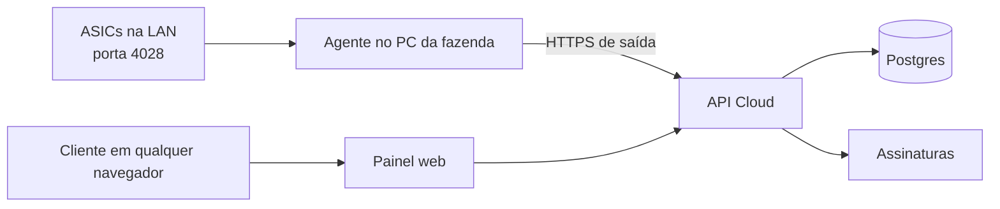

# Arquitetura inicial

## Agente local, não navegador

Um navegador não pode varrer IPs da rede local nem abrir sockets TCP para a porta
4028 das ASICs. Por isso o produto terá um executável Windows sem interface,
instalado como serviço no PC principal da fazenda. Ele inicia com o Windows,
faz as leituras locais e envia somente os resultados para a API em nuvem.

## Infraestrutura proposta

| Necessidade | Serviço inicial |
| --- | --- |
| Painel e API | Next.js em Vercel |
| Banco de dados | Postgres gerenciado |
| Autenticação | Organizações e permissões por usuário |
| Assinaturas | Faturas em USDT na rede Solana e monitoramento on-chain |
| Agente | Python empacotado como serviço Windows sem interface |

## Entidades

- **User**: pessoa que faz login.
- **Organization**: conta comercial do cliente.
- **Farm**: fazenda dentro de uma organização.
- **Agent**: instalação autorizada no PC da fazenda.
- **Miner**: ASIC cadastrada manualmente.
- **Metric**: leitura enviada pelo agente.
- **Subscription**: licença e estado da assinatura.

## Painel administrativo

O SaaS tem uma área exclusiva para operadores, em `/admin`, acessível somente
por usuários com `profiles.platform_role` preenchido (`admin` ou
`super_admin` — ver "Papéis" abaixo) via `requirePlatformAdmin()`
(`apps/web/lib/org-data.ts`), que redireciona pro `/dashboard` do cliente caso
contrário. Essa área não usa o escopo de uma organização de cliente e permite
controlar a operação inteira. Uma conta com esse papel vê um atalho fixo
("⚙ Painel admin", `apps/web/app/components.tsx`) no canto superior direito de
qualquer página do painel do cliente — o login sempre cai no dashboard normal
primeiro, o atalho é o caminho pra alternar pro `/admin`.

### Implementado hoje

- `/admin`: lista todas as organizações com e-mail do dono, nº de máquinas,
  hashrate total (mesma lógica de "fresco" do dashboard do cliente, 90s),
  licenças ativas e última fatura. Card de hashrate total da plataforma.
  Organizações cujo(s) único(s) membro(s) foram excluídos (ver Gestão de
  Usuários) somem dessa lista — a organização em si não é apagada.
- `/admin/orgs/[id]`: detalhe por organização — métricas (máquinas online,
  hashrate, consumo, licenças ativas), membros (linkados pro detalhe de cada
  usuário em `/admin/users/[id]`), máquinas, faturas e lotes de licença.
- **`/admin/users` — Gestão de Usuários** (`apps/web/app/admin/users/`,
  `apps/web/lib/admin/`): painel de ciclo de vida de conta, cobrindo hoje a
  aba Perfil (as abas ASICs/Fazendas/Sessões/Histórico existem como
  placeholder "em breve" pra fases futuras).
  - Lista: cards (total, ativos, suspensos, bloqueados, novos em 30 dias,
    com/sem ASIC, administradores, excluídos), busca, filtros (status,
    perfil, e-mail verificado, ASICs), ordenação por coluna e paginação —
    tudo calculado em memória sobre `listPlatformUsers()`, que junta
    `profiles` + `auth.admin.listUsers()` + contagem de ASICs/fazendas via
    `memberships` (sem coluna de organização direta em `profiles`).
  - Detalhe: editar perfil (nome, telefone, empresa, cargo, timezone, país,
    observações administrativas — só visíveis a admin), trocar e-mail (duas
    opções: confirmar na hora ou exigir código de 6 dígitos do próprio
    usuário, ver seção de confirmação de e-mail abaixo), trocar username,
    resetar senha (link padrão ou senha temporária com exigência de troca),
    status da conta (ativo/inativo/suspenso/bloqueado com motivo — suspender/
    bloquear usa o ban nativo do GoTrue via `admin.updateUserById(id,
    { ban_duration })`, não só um campo decorativo), nível de administrador
    (só super_admin) e exclusão (soft delete, só super_admin).
  - **Exclusão de usuário** (`deleteUser`/`restoreUser` em
    `admin/users/actions.ts`): marca `profiles.deleted_at`/`deleted_by` e
    aplica o ban do GoTrue — nunca apaga a organização/fazendas/ASICs do
    usuário, porque não existe caminho de exclusão em cascata de `profiles`
    para `organizations` (a relação é via `memberships`, no sentido
    contrário), então apagar de verdade deixaria recursos órfãos sem dono.
    Reversível pelo botão "Restaurar conta". Protegido contra
    autoexclusão e contra remover o último `super_admin`.
  - Todas as ações passam por `logAdminAction()`
    (`apps/web/lib/admin/audit.ts`), gravando em `admin_audit_logs`
    (`supabase/migrations/0017_admin_user_management.sql`) — nunca com senha
    ou código em texto puro.
- Reset de senha de qualquer usuário a partir do painel admin
  (`apps/web/app/admin/user-actions.ts`, usado no detalhe de organização):
  dispara o fluxo padrão de "esqueci minha senha" do Supabase
  (`resetPasswordForEmail`) para o e-mail do usuário-alvo — o admin nunca vê
  nem define a senha real, só aciona o e-mail de redefinição.

### Ainda não implementado

- Aba ASICs/Fazendas do usuário com transferência de propriedade, aba
  Sessões (listar/encerrar sessões ativas) e aba Histórico (linha do tempo de
  `admin_audit_logs` filtrada por usuário) na Gestão de Usuários.
  Impersonação ("entrar como usuário") e exportação CSV/XLSX da lista.
  Exclusão permanente (hard delete) — hoje só existe soft delete.
- Página de "minha conta" para o usuário comum trocar o próprio e-mail/senha
  sem passar pelo admin (não existe nenhuma tela de configurações de conta
  pro cliente final ainda).
- Bloquear/reativar cliente, suspender coleta, criar licença de demonstração
  pela UI (hoje licenças extras são inseridas manualmente via SQL/Supabase).
- Gerar/revogar código de ativação de agente pelo painel admin.
- Indicadores agregados de receita recorrente e inadimplência.

### Papéis

Dois níveis independentes — plataforma (quem acessa `/admin`) e organização
(o que cada membro pode fazer dentro da própria conta):

| Papel | Escopo | Permissão |
| --- | --- | --- |
| `profiles.platform_role = 'super_admin'` | Plataforma | Tudo em `platform_role = 'admin'`, mais: promover/rebaixar administradores, excluir usuários. Não pode remover o último `super_admin` do sistema nem alterar a própria permissão. |
| `profiles.platform_role = 'admin'` | Plataforma | Gestão de Usuários, organizações e indicações — ações que não sejam exclusivas de `super_admin` |
| `org_owner` | Organização | Assinatura, usuários, fazendas e máquinas da própria organização |
| `org_operator` | Organização | Visualização e operação das fazendas autorizadas |
| `org_viewer` | Organização | Somente leitura do painel |

`profiles.platform_admin` (booleano) continua existindo só por compatibilidade
com código antigo (`requirePlatformAdmin()`/middleware) — é sincronizado
automaticamente a partir de `platform_role` por um trigger
(`sync_platform_admin`, na mesma migration 0017): `true` sempre que
`platform_role` não é nulo, `false` quando é. Código novo deve checar
`platform_role` (`requireSuperAdmin()`/`isSuperAdmin()` em
`apps/web/lib/admin/permissions.ts`) quando precisar distinguir os dois
níveis; `requirePlatformAdmin()` continua servindo pra "é algum tipo de
admin".

## Licença e cobrança

Máquinas cadastradas e ativas contam para a cobrança. A plataforma compara o total ativo com a quantidade licenciada. Preço único de US$ 1,00 por máquina/mês (`apps/web/lib/pricing.ts`, `DEFAULT_PRICING_TIERS`), sem faixas por volume — configurável futuramente pelo painel admin, hoje vive só no código.

Toda organização nova ganha automaticamente um lote de **3 licenças grátis,
válidas por 30 dias**, criado pelo mesmo trigger que cria a organização no
cadastro (`handle_new_user()`, `supabase/migrations/0008_free_trial_licenses.sql`).
A migration também faz backfill: qualquer organização já existente sem nenhum
lote de licença recebe o mesmo trial retroativamente. Licenças extras (pagas
ou de cortesia) hoje são criadas manualmente via SQL Editor do Supabase,
inserindo direto na tabela `license_batches` — não existe fluxo de UI para
isso ainda (ver "Ainda não implementado" no painel administrativo).

## Autenticação e captcha

O login e o cadastro exigem verificação do **Cloudflare Turnstile** quando
`NEXT_PUBLIC_TURNSTILE_SITE_KEY` está configurada (local e produção usam a
mesma site key, com os domínios `localhost`, `127.0.0.1` e o domínio de
produção liberados no widget, no dashboard do Cloudflare). O secret key
correspondente fica configurado em Supabase → Authentication → Attack
Protection, então a verificação acontece nativamente dentro do
`signInWithPassword`/`signUp` do Supabase Auth — o código do app só precisa
repassar o `cf-turnstile-response` recebido do formulário. Exceção: o
cadastro (`signUp()`) cria a conta pela API administrativa (ver "Confirmação
de e-mail" abaixo), que não recebe `captchaToken` — nesse caso a verificação
acontece no `signInWithPassword` imediatamente seguinte, não na criação em
si.

Não configurar `NEXT_PUBLIC_TURNSTILE_SITE_KEY` em desenvolvimento local é a
forma suportada de testar sem o widget — o site key de produção não valida o
domínio `localhost` do Turnstile (mesmo estando na allowlist do App), então
tentar logar localmente com a chave de produção configurada tende a travar
com "Confirme que você não é um robô." Comente a variável no `.env.local`,
reinicie o `next dev`, teste, e lembre de descomentar antes de terminar —
sem ela, o backend simplesmente não exige o token (`if
(process.env.NEXT_PUBLIC_TURNSTILE_SITE_KEY && !captchaToken)`).

O widget é renderizado por um componente cliente dedicado
(`apps/web/app/turnstile-widget.tsx`) que monta o widget via
`window.turnstile.render(...)` depois do `useEffect`, em vez do modo
implícito (`data-sitekey` direto no HTML). O modo implícito causava um erro
de hidratação nessa página (Server Component): o script preenchia a div antes
do React terminar de hidratar, o React descartava a árvore e recriava do
zero no cliente, e como o script só faz o auto-scan uma vez, o widget nunca
mais aparecia — o usuário ficava preso na mensagem "Confirme que você não é
um robô." para sempre. Qualquer novo lugar que precise do captcha deve
reusar esse componente, não o padrão `data-sitekey`.

## Confirmação de e-mail por código de 6 dígitos

O cadastro não usa mais o link de confirmação nativo do Supabase — o usuário
confirma o e-mail digitando um código de 6 dígitos, com o estado de
confirmação sempre igual em `auth.users.email_confirmed_at` (nunca existe um
"confirmado aqui, não confirmado ali").

- **Cadastro** (`signUp()`, `apps/web/app/auth/actions.ts`): cria a conta via
  `service.auth.admin.createUser({ email_confirm: false })` (API
  administrativa, não o `signUp()` anônimo) — isso evita o e-mail de
  confirmação nativo do Supabase por completo, então só o nosso código de 6
  dígitos é enviado. Como `admin.createUser` não recebe `captchaToken`, a
  verificação do Turnstile passa a acontecer no `signInWithPassword`
  imediatamente seguinte; se falhar, a conta recém-criada é apagada (nunca
  fica um registro órfão sem verificação nenhuma). Contas criadas antes dessa
  mudança já nasceram confirmadas (a confirmação de e-mail do projeto estava
  desativada) e não são afetadas — não precisaram de backfill.
- **Núcleo** (`apps/web/lib/otp.ts`): `generateAndSendCode`/`verifyCode`,
  usado tanto no cadastro quanto na troca de e-mail. Código gerado com
  `crypto.randomInt`, só o hash (`sha256`) fica salvo, validade de 10
  minutos, 5 tentativas por código (trava e exige um novo ao esgotar),
  cooldown de reenvio de 60s, limite de 5 envios por hora — um novo código
  sempre invalida o anterior (só um código ativo por `user_id`+`purpose`).
  Envio via Resend, mesmo padrão de `lib/asic-alerts/email.ts`. O `purpose`
  (`email_verification` | `email_change`) impede que um código de um fluxo
  confirme o outro.
- **Tabela** `email_verification_codes`
  (`supabase/migrations/0019_email_verification_codes.sql`): só guarda o
  mecanismo de entrega/validação — nunca um segundo estado de "confirmado".
  `profiles.pending_email` guarda o novo endereço durante uma troca de e-mail
  pendente; `auth.users.email` só é atualizado quando o código é confirmado,
  pra nunca travar o usuário fora da própria conta por causa de um endereço
  digitado errado.
- **Middleware** (`apps/web/lib/supabase/proxy.ts`): qualquer usuário
  autenticado sem `email_confirmed_at` é redirecionado pra `/verify-email`,
  exceto nas próprias rotas de auth — reforçado no middleware, não só numa
  página, então não dá pra contornar trocando a URL manualmente.
- **`/verify-email`**: seis campos individuais com foco automático, aceita
  colar o código completo, confirma com Enter ou ao preencher o último
  dígito, reenvio com contagem regressiva visível. Detecta sozinho se é
  confirmação de cadastro ou de troca de e-mail (checando
  `profiles.pending_email`).
- **Admin Center**: trocar e-mail de um usuário agora oferece duas opções —
  confirmar na hora (`changeUserEmail`, como já existia) ou exigir código do
  próprio usuário (`requestEmailChangeWithCode`, novo). Também dá pra
  reenviar o código (`resendVerificationCode`) e, só como `super_admin`,
  marcar como confirmado sem código (`markEmailConfirmed`) — sempre com
  registro em `admin_audit_logs`.

Fora do escopo por enquanto: reset de senha continua no link tradicional do
Supabase (não foi convertido pra OTP), e não existe OTP genérico pra "ações
sensíveis".

## Pagamentos em USDT

O SaaS não depende de uma exchange para receber pagamentos: monitora os
pagamentos diretamente na blockchain, na rede **Solana**. Cada fatura recebe um
**endereço de depósito exclusivo**, não uma carteira compartilhada — é isso que
permite identificar quem pagou mesmo quando o pagamento vem sem memo/tag, como
um saque direto de exchange (Binance etc. não deixam anexar memo num saque de
Solana).

1. Ao gerar uma fatura, `createLicensePurchase` (`app/billing/actions.ts`)
   deriva um par de chaves Solana exclusivo para aquela fatura e grava só o
   endereço público (`invoices.wallet_address` / `deposit_address`).
2. O painel mostra esse endereço, QR Code (Solana Pay URI), valor e status
   pendente. O QR e o endereço copiável apontam para o endereço da própria
   fatura, não para uma carteira fixa do sistema.
3. `verifyLicensePurchase` consulta a rede Solana pelas transferências USDT
   recebidas *naquele endereço específico*; qualquer valor recebido lá já
   identifica a fatura, sem depender de memo ou de um valor fracionário único.
4. Após confirmar, o sistema varre (sweep) o saldo do endereço da fatura para
   a carteira de tesouraria (`BILLING_WALLET_PUBLIC_KEY`), registrando
   `invoices.swept_at`/`sweep_signature`. Se a varredura falhar, o pagamento já
   fica confirmado mesmo assim — o saldo continua seguro no endereço da fatura
   até a próxima tentativa, já que a chave privada é recalculável a qualquer momento.
5. A confirmação ativa ou renova a licença automaticamente.
6. O pagamento atrasado aplica período de tolerância e, depois, suspende coleta
   e acesso até a regularização, sem apagar os dados do cliente.

### Custódia das chaves (`lib/solana-wallet.ts`)

Nenhuma chave privada de fatura é persistida. `deriveInvoiceKeypair(reference)`
recalcula o par de chaves sob demanda via HMAC-SHA512 de uma semente mestra
(`INVOICE_DERIVATION_SEED`, variável de ambiente só no servidor) com a
referência da fatura como mensagem, truncado a 32 bytes e usado como seed
Ed25519. A mesma referência sempre deriva o mesmo endereço; referências
diferentes derivam endereços diferentes — não há como recuperar a chave
mestra a partir de um endereço derivado.

A varredura (sweep) usa uma segunda carteira, dedicada e de baixo valor — a
"carteira de combustível" (`FEE_PAYER_SECRET_KEY`) — que só paga a taxa de rede
da transação de varredura. A carteira de tesouraria (`BILLING_WALLET_PUBLIC_KEY`)
nunca precisa da própria chave privada no servidor: quem assina a varredura é o
par derivado da fatura (dono do token account de origem) e a carteira de
combustível (paga a taxa). Um comprometimento da carteira de combustível não dá
acesso aos fundos do cliente nem da tesouraria — na pior hipótese, alguém gasta
o pouco SOL nela depositado para cobrir taxas.

## Ocorrências, alertas e logs em tempo real (`lib/asic-alerts/`)

Motor de regras centralizado que roda em cima da telemetria já existente —
não é um sistema paralelo. Fluxo: `POST /api/agent/metrics` insere a
leitura, lê o estado anterior da mesma máquina, normaliza os dois
(`normalize.ts`) e roda cada regra (`rules.ts`) comparando contra a
configuração da organização (`alert_settings`, com defaults sensatos e
personalizável por org). Cada regra que "bate" vira uma linha em
`asic_incidents` — uma só por `(miner_id, rule_key)` enquanto o problema
persiste (índice único parcial), atualizada a cada ciclo em vez de duplicada;
quando a regra para de bater, a ocorrência é resolvida automaticamente e um
evento de recuperação é gravado. `asic_events` guarda o log curado (o que
aparece na tela "Eventos recentes" da máquina); não existe uma tabela de log
bruto — o payload que o agente já envia a cada ciclo (`miner_metrics.payload`)
já é o dado bruto, reconstituído sob demanda em vez de duplicado.

- **Regras implementadas:** `reboot_detected` (queda de uptime), `hashboard_failure`
  (placa que zera ou some do relatório), `zero_hashrate`, `hashrate_degraded`
  (contra a própria média saudável da máquina — `miners.baseline_hashrate_ths`,
  uma média móvel lenta, não um catálogo fixo de TH/s por modelo, que seria
  inventado), `temperature_high` (dois níveis, warning/critical) e `fan_failure`
  (best-effort, só quando o firmware reporta RPM).
- **`miner_offline`** não dá pra detectar dentro do POST (é ausência de dado que
  importa) — usa o mesmo padrão já existente em `lib/affiliate.ts`
  (`releaseMaturedCommissions`): checagem "preguiçosa" a cada carregamento da
  Visão Geral/página da fazenda (`offline-sweep.ts`), com um cron diário como
  backstop (`/api/cron/asic-health-sweep` — diário porque o único cron já
  existente no projeto roda 1x/dia, sinal de que não dá pra agendar algo mais
  frequente no plano atual do Vercel).
- **Deduplicação e anti-spam:** e-mail só sai se `alert_settings.email_enabled`,
  a regra não estiver desabilitada, e (a) é a primeira detecção ou (b) já
  passou `reminder_cooldown_minutes` desde o último e-mail daquela ocorrência.
  `hashrate_degraded` também exige a ocorrência ativa há pelo menos
  `hashrate_window_minutes` antes do primeiro e-mail (não é o valor isolado de
  uma leitura). Falha no envio (Resend, via `email.ts`) nunca bloqueia o resto
  do pipeline nem marca a ocorrência como notificada — fica registrada em
  `alert_notifications` como `failed` e a próxima tentativa não espera o
  cooldown inteiro.
- **Reconhecer ≠ resolver:** `status` tem três valores (`active`, `acknowledged`,
  `resolved`); reconhecer só marca quem/quando (`acknowledged_by/_at`) — o
  motor continua atualizando e pode resolver normalmente uma ocorrência
  reconhecida (por isso o índice único cobre `active` e `acknowledged` juntos).
- **Saúde da máquina** (🟢🟡🔴⚫ no `farms/[id]`) é sempre derivada das
  ocorrências ativas daquela máquina, nunca um campo separado que possa
  divergir delas.

Requer `RESEND_API_KEY` (e opcionalmente `ALERT_EMAIL_FROM`) configurada no
Vercel — sem ela, o motor continua registrando ocorrências normalmente, só o
e-mail fica marcado como `skipped`.

## Consumo de energia (`miner_energy_daily`)

O card "Consumo registrado · 30 dias" do dashboard soma um rollup diário
(`miner_energy_daily`, `supabase/migrations/0020_miner_energy_daily.sql`,
uma linha por máquina/dia) em vez de reintegrar telemetria bruta a cada
visita. `POST /api/agent/metrics` já lê a leitura anterior de cada máquina
pra alimentar o motor de alertas (comparar "antes vs agora") — a mesma
leitura agora também calcula o delta de energia (trapézio entre a potência
anterior e a atual, gap grande limitado a 5min) e incrementa o rollup via
`increment_miner_energy` (função SQL com `ON CONFLICT DO UPDATE`, atômica
sob posts concorrentes de agentes diferentes). O dashboard só soma as
últimas 30 linhas por máquina — não depende mais do volume de telemetria
histórica, só do número de máquinas × 30.

Antes disso, o dashboard buscava até 10.000 linhas de `miner_metrics` dos
últimos 30 dias em toda visita (pra esse cálculo e pro card de hashrate) —
num plano com throughput de banco limitado, isso rodava em cada carregamento
da Visão Geral, de todo cliente. Ver `docs/configuration.md` pra contexto
sobre a capacidade atual do banco.

## Fases

1. Contas, organizações, fazendas, serviço coletor e ingestão de métricas.
2. Painel multiempresa e cadastro manual de ASICs.
3. Stripe, licença por máquina e bloqueio por assinatura.
4. Instalador Windows, atualização automática e alertas.
