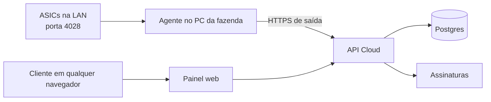

# Arquitetura inicial

## Agente local, não navegador

Um navegador não pode varrer IPs da rede local nem abrir sockets TCP para a porta
4028 das ASICs. Por isso o produto terá um executável Windows sem interface,
instalado como serviço no PC principal da fazenda. Ele inicia com o Windows,
faz as leituras locais e envia somente os resultados para a API em nuvem.

## Infraestrutura proposta

| Necessidade | Serviço inicial |
| --- | --- |
| Painel e API | Next.js em Vercel |
| Banco de dados | Postgres gerenciado |
| Autenticação | Organizações e permissões por usuário |
| Assinaturas | Faturas em USDT na rede Solana e monitoramento on-chain |
| Agente | Python empacotado como serviço Windows sem interface |

## Entidades

- **User**: pessoa que faz login.
- **Organization**: conta comercial do cliente.
- **Farm**: fazenda dentro de uma organização.
- **Agent**: instalação autorizada no PC da fazenda.
- **Miner**: ASIC cadastrada manualmente.
- **Metric**: leitura enviada pelo agente.
- **Subscription**: licença e estado da assinatura.

## Painel administrativo

O SaaS tem uma área exclusiva para operadores, em `/admin`, acessível somente
por usuários com `profiles.platform_admin = true` (`requirePlatformAdmin()` em
`apps/web/lib/org-data.ts`, redireciona pro `/dashboard` do cliente caso
contrário). Essa área não usa o escopo de uma organização de cliente e permite
controlar a operação inteira. Uma conta com esse papel vê um atalho fixo
("⚙ Painel admin", `apps/web/app/components.tsx`) no canto superior direito de
qualquer página do painel do cliente — o login sempre cai no dashboard normal
primeiro, o atalho é o caminho pra alternar pro `/admin`.

### Implementado hoje

- `/admin`: lista todas as organizações com e-mail do dono, nº de máquinas,
  hashrate total (mesma lógica de "fresco" do dashboard do cliente, 90s),
  licenças ativas e última fatura. Card de hashrate total da plataforma.
- `/admin/orgs/[id]`: detalhe por organização — métricas (máquinas online,
  hashrate, consumo, licenças ativas), membros, máquinas, faturas e lotes de
  licença.
- Reset de senha de qualquer usuário a partir do painel admin
  (`apps/web/app/admin/user-actions.ts`): dispara o fluxo padrão de
  "esqueci minha senha" do Supabase (`resetPasswordForEmail`) para o e-mail do
  usuário-alvo — o admin nunca vê nem define a senha real, só aciona o e-mail
  de redefinição, e a ação é sempre gateada por `requirePlatformAdmin()`.

### Ainda não implementado

- Bloquear/reativar cliente, suspender coleta, criar licença de demonstração
  pela UI (hoje licenças extras são inseridas manualmente via SQL/Supabase).
- Gerar/revogar código de ativação de agente pelo painel admin.
- Indicadores agregados de receita recorrente e inadimplência.

### Papéis

| Papel | Permissão |
| --- | --- |
| `platform_admin` | Administração global do SaaS e suporte a clientes |
| `org_owner` | Assinatura, usuários, fazendas e máquinas da própria organização |
| `org_operator` | Visualização e operação das fazendas autorizadas |
| `org_viewer` | Somente leitura do painel |

## Licença e cobrança

Máquinas cadastradas e ativas contam para a cobrança. A plataforma compara o total ativo com a quantidade licenciada. Preço único de US$ 1,00 por máquina/mês (`apps/web/lib/pricing.ts`, `DEFAULT_PRICING_TIERS`), sem faixas por volume — configurável futuramente pelo painel admin, hoje vive só no código.

Toda organização nova ganha automaticamente um lote de **3 licenças grátis,
válidas por 30 dias**, criado pelo mesmo trigger que cria a organização no
cadastro (`handle_new_user()`, `supabase/migrations/0008_free_trial_licenses.sql`).
A migration também faz backfill: qualquer organização já existente sem nenhum
lote de licença recebe o mesmo trial retroativamente. Licenças extras (pagas
ou de cortesia) hoje são criadas manualmente via SQL Editor do Supabase,
inserindo direto na tabela `license_batches` — não existe fluxo de UI para
isso ainda (ver "Ainda não implementado" no painel administrativo).

## Autenticação e captcha

O login e o cadastro exigem verificação do **Cloudflare Turnstile** quando
`NEXT_PUBLIC_TURNSTILE_SITE_KEY` está configurada (local e produção usam a
mesma site key, com os domínios `localhost`, `127.0.0.1` e o domínio de
produção liberados no widget, no dashboard do Cloudflare). O secret key
correspondente fica configurado em Supabase → Authentication → Attack
Protection, então a verificação acontece nativamente dentro do
`signInWithPassword`/`signUp` do Supabase Auth — o código do app só precisa
repassar o `cf-turnstile-response` recebido do formulário.

O widget é renderizado por um componente cliente dedicado
(`apps/web/app/turnstile-widget.tsx`) que monta o widget via
`window.turnstile.render(...)` depois do `useEffect`, em vez do modo
implícito (`data-sitekey` direto no HTML). O modo implícito causava um erro
de hidratação nessa página (Server Component): o script preenchia a div antes
do React terminar de hidratar, o React descartava a árvore e recriava do
zero no cliente, e como o script só faz o auto-scan uma vez, o widget nunca
mais aparecia — o usuário ficava preso na mensagem "Confirme que você não é
um robô." para sempre. Qualquer novo lugar que precise do captcha deve
reusar esse componente, não o padrão `data-sitekey`.

## Pagamentos em USDT

O SaaS não dependerá de uma exchange para receber pagamentos. Em vez disso, terá
uma carteira de recebimento própria e monitorará os pagamentos diretamente na
blockchain. A rede aceita será **Solana**, e a página de fatura deixará essa rede
explícita para impedir depósitos por uma rede incorreta.

1. No início de cada ciclo, a API cria uma fatura com o número de máquinas
   licenciadas, desconto aplicado, total em USDT e data de vencimento.
2. O painel mostra endereço, QR Code, valor exato, rede Solana e status pendente.
3. O monitor on-chain consulta os eventos de transferência USDT da carteira de
   recebimento na Solana e exige confirmações mínimas antes de marcar uma fatura como paga.
4. A confirmação ativa ou renova a licença automaticamente.
5. O pagamento atrasado aplica período de tolerância e, depois, suspende coleta
   e acesso até a regularização, sem apagar os dados do cliente.

Cada fatura terá um identificador de pagamento exclusivo. A versão inicial pode
usar um endereço exclusivo por fatura; depois, quando o volume crescer, um
serviço de carteira derivada gera endereços por organização sem expor a chave
privada ao painel nem à API de uso diário.

## Fases

1. Contas, organizações, fazendas, serviço coletor e ingestão de métricas.
2. Painel multiempresa e cadastro manual de ASICs.
3. Stripe, licença por máquina e bloqueio por assinatura.
4. Instalador Windows, atualização automática e alertas.
