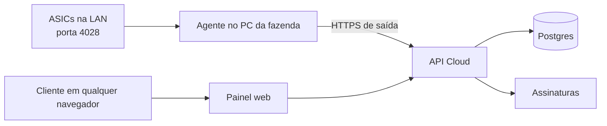

# Arquitetura inicial

## Agente local, não navegador

Um navegador não pode varrer IPs da rede local nem abrir sockets TCP para a porta
4028 das ASICs. Por isso o produto terá um executável Windows sem interface,
instalado como serviço no PC principal da fazenda. Ele inicia com o Windows,
faz as leituras locais e envia somente os resultados para a API em nuvem.



## Infraestrutura

| Necessidade | Serviço |
| --- | --- |
| Painel e API | Next.js self-hosted numa VPS (Hostinger KVM1), via EasyPanel/Docker Swarm + Traefik (TLS automático) |
| Banco de dados | Postgres self-hosted (pilha oficial `supabase/supabase`, Docker Compose, na mesma VPS) |
| Autenticação | Organizações e permissões por usuário |
| Assinaturas | Faturas em USDT na rede Solana e monitoramento on-chain |
| Agente | Python empacotado como `.exe` Windows (com janela); telemetria, comandos e túnel de acesso remoto |
| Acesso remoto | Serviço `relay` (Node, `apps/relay`) no EasyPanel + certificado curinga `*.remote.monitorasic.club` (ver "Acesso remoto à tela da ASIC") |

Rodou em Vercel + Supabase Cloud (plano Free) até 2026-09-18, quando a
instância `t3.nano` do Supabase Cloud começou a saturar (~98% CPU sob carga
normal, timeouts de conexão) e a operação foi migrada para self-hosted —
banco de dados inteiro (`pg_dump`/`pg_restore`, `auth` + `public`) e
aplicação (novo `apps/web/Dockerfile`) para a mesma VPS, com domínio próprio
(`monitorasic.club` para o app, `db.monitorasic.club` para o Supabase) atrás
de Traefik com certificados Let's Encrypt reais. Detalhes operacionais
(variáveis de ambiente, cron jobs, DNS, pendências de auto-deploy) em
`docs/configuration.md`. O projeto Supabase Cloud antigo e o projeto Vercel
foram pausados (não apagados) em 2026-09-18 — como retomar e o que ficou só
no banco antigo estão em "Descomissionamento" no mesmo documento.

## Entidades

- **User**: pessoa que faz login.
- **Organization**: conta comercial do cliente.
- **Farm**: fazenda dentro de uma organização.
- **Agent**: instalação autorizada no PC da fazenda.
- **Miner**: ASIC cadastrada manualmente (`web_port`, padrão 80, é a porta da
  tela web usada pelo acesso remoto).
- **Metric**: leitura enviada pelo agente.
- **Subscription**: licença e estado da assinatura.
- **License batch**: lote de licenças com validade (compra ou concessão manual do admin).
- **Remote access log** (`remote_access_logs`): quem abriu qual máquina, quando e de
  que IP; também registra ligar/desligar o acesso remoto da fazenda
  (`farms.remote_access_enabled`, padrão desligado).

## Painel administrativo

O SaaS tem uma área exclusiva para operadores, em `/admin`, acessível somente
por usuários com `profiles.platform_role` preenchido (`admin` ou
`super_admin` — ver "Papéis" abaixo) via `requirePlatformAdmin()`
(`apps/web/lib/org-data.ts`), que redireciona pro `/dashboard` do cliente caso
contrário. Essa área não usa o escopo de uma organização de cliente e permite
controlar a operação inteira. Uma conta com esse papel vê um atalho fixo
("⚙ Painel admin", `apps/web/app/components.tsx`) no canto superior direito de
qualquer página do painel do cliente — o login sempre cai no dashboard normal
primeiro, o atalho é o caminho pra alternar pro `/admin`. No celular/tablet
estreito o atalho fixo some e o mesmo link aparece no menu ☰ do topo.

### Implementado hoje

- `/admin`: lista todas as organizações com e-mail do dono, nº de máquinas,
  hashrate total (mesma lógica de "fresco" do dashboard do cliente, 90s),
  licenças ativas e última fatura. Card de hashrate total da plataforma.
  Organizações cujo(s) único(s) membro(s) foram excluídos (ver Gestão de
  Usuários) somem dessa lista — a organização em si não é apagada.
- `/admin/orgs/[id]`: detalhe por organização — métricas (máquinas online,
  hashrate, consumo, licenças ativas), membros (linkados pro detalhe de cada
  usuário em `/admin/users/[id]`), máquinas, faturas e lotes de licença.
- **`/admin/users` — Gestão de Usuários** (`apps/web/app/admin/users/`,
  `apps/web/lib/admin/`): painel de ciclo de vida de conta, cobrindo hoje a
  aba Perfil (as abas ASICs/Fazendas/Sessões/Histórico existem como
  placeholder "em breve" pra fases futuras).
  - Lista: cards (total, ativos, suspensos, bloqueados, novos em 30 dias,
    com/sem ASIC, administradores, excluídos), busca, filtros (status,
    perfil, e-mail verificado, ASICs), ordenação por coluna e paginação —
    tudo calculado em memória sobre `listPlatformUsers()`, que junta
    `profiles` + `auth.admin.listUsers()` + contagem de ASICs/fazendas via
    `memberships` (sem coluna de organização direta em `profiles`).
  - Detalhe: editar perfil (nome, telefone, empresa, cargo, timezone, país,
    observações administrativas — só visíveis a admin), trocar e-mail (duas
    opções: confirmar na hora ou exigir código de 6 dígitos do próprio
    usuário, ver seção de confirmação de e-mail abaixo), trocar username,
    redefinir senha (senha temporária por e-mail ou senha manual — ver
    "Senhas" abaixo),
    status da conta (ativo/inativo/suspenso/bloqueado com motivo — suspender/
    bloquear usa o ban nativo do GoTrue via `admin.updateUserById(id,
    { ban_duration })`, não só um campo decorativo), nível de administrador
    (só super_admin) e exclusão (soft delete, só super_admin).
  - **Exclusão de usuário** (`deleteUser`/`restoreUser` em
    `admin/users/actions.ts`): marca `profiles.deleted_at`/`deleted_by` e
    aplica o ban do GoTrue — nunca apaga a organização/fazendas/ASICs do
    usuário, porque não existe caminho de exclusão em cascata de `profiles`
    para `organizations` (a relação é via `memberships`, no sentido
    contrário), então apagar de verdade deixaria recursos órfãos sem dono.
    Reversível pelo botão "Restaurar conta". Protegido contra
    autoexclusão e contra remover o último `super_admin`.
  - **Licenças manuais** (só `super_admin`, `admin/users/license-actions.ts` +
    `[id]/licenses-card.tsx`): lista os lotes de cada organização do usuário
    (ativo/pendente/expirado/encerrado, origem fatura ou manual) e permite
    **conceder N licenças** com validade em dias ou até uma data (fim do dia,
    horário de Brasília; máx. 20 anos) — cria um `license_batches` `active` sem
    `invoice_id`, sem comissão de afiliado — e **encerrar** um lote ativo na hora
    (`status = 'cancelled'`). Recalcula o resumo em `subscriptions`
    (`lib/license.ts#refreshSubscriptionLicenses`) e grava
    `license_granted`/`license_revoked` em `admin_audit_logs`.
  - Todas as ações passam por `logAdminAction()`
    (`apps/web/lib/admin/audit.ts`), gravando em `admin_audit_logs`
    (`supabase/migrations/0017_admin_user_management.sql`) — nunca com senha
    ou código em texto puro.
- **Painel único de Gestão:** `/admin` (Clientes, por organização) e
  `/admin/users` (Usuários) são abas do mesmo painel (`app/admin/admin-tabs.tsx`)
  sob uma única entrada "Gestão" no menu; senha, licenças e status ficam no
  detalhe do usuário (`/admin/users/[id]`), que também é o destino dos links de
  membros na página da organização.
- **Senhas** (`admin/users/actions.ts`, `[id]/password-actions.tsx`): (1)
  "Enviar senha temporária por e-mail" — gera uma senha aleatória de 12
  caracteres, define no usuário com `force_password_change` e manda por
  e-mail (`lib/password-email.ts`, Resend); (2) definir a senha à mão, com
  opções de exigir troca no próximo login e/ou mandar por e-mail. Se a senha é
  definida mas o e-mail falha, a tela avisa e é só repetir. A senha nunca vai
  para `admin_audit_logs`. O reset por link do GoTrue
  (`resetPasswordForEmail`) foi removido: o Supabase self-hosted só tem SMTP
  falso (`supabase-mail`), então o e-mail nunca chegava.
- **Troca obrigatória de senha:** `force_password_change` em `user_metadata`
  agora é aplicado no middleware (`lib/supabase/proxy.ts`): o usuário é levado a
  `/change-password` antes de qualquer outra página e o flag é limpo quando ele
  salva uma senha nova. A tela também fica acessível a qualquer usuário logado
  pelo link "Alterar senha" no menu lateral.

### Ainda não implementado

- Aba ASICs/Fazendas do usuário com transferência de propriedade, aba
  Sessões (listar/encerrar sessões ativas) e aba Histórico (linha do tempo de
  `admin_audit_logs` filtrada por usuário) na Gestão de Usuários.
  Impersonação ("entrar como usuário") e exportação CSV/XLSX da lista.
  Exclusão permanente (hard delete) — hoje só existe soft delete.
- Página de "minha conta" para o usuário comum trocar o próprio e-mail/senha
  sem passar pelo admin (não existe nenhuma tela de configurações de conta
  pro cliente final ainda).
- Bloquear/reativar cliente e suspender coleta pela UI.
- Gerar/revogar código de ativação de agente pelo painel admin.
- Indicadores agregados de receita recorrente e inadimplência.

### Papéis

Dois níveis independentes — plataforma (quem acessa `/admin`) e organização
(o que cada membro pode fazer dentro da própria conta):

| Papel | Escopo | Permissão |
| --- | --- | --- |
| `profiles.platform_role = 'super_admin'` | Plataforma | Tudo em `platform_role = 'admin'`, mais: promover/rebaixar administradores, excluir usuários. Não pode remover o último `super_admin` do sistema nem alterar a própria permissão. |
| `profiles.platform_role = 'admin'` | Plataforma | Gestão de Usuários, organizações e indicações — ações que não sejam exclusivas de `super_admin` |
| `org_owner` | Organização | Assinatura, usuários, fazendas e máquinas da própria organização |
| `org_operator` | Organização | Visualização e operação das fazendas autorizadas |
| `org_viewer` | Organização | Somente leitura do painel |

`profiles.platform_admin` (booleano) continua existindo só por compatibilidade
com código antigo (`requirePlatformAdmin()`/middleware) — é sincronizado
automaticamente a partir de `platform_role` por um trigger
(`sync_platform_admin`, na mesma migration 0017): `true` sempre que
`platform_role` não é nulo, `false` quando é. Código novo deve checar
`platform_role` (`requireSuperAdmin()`/`isSuperAdmin()` em
`apps/web/lib/admin/permissions.ts`) quando precisar distinguir os dois
níveis; `requirePlatformAdmin()` continua servindo pra "é algum tipo de
admin".

## Licença e cobrança

Máquinas cadastradas e ativas contam para a cobrança. A plataforma compara o total ativo com a quantidade licenciada. Preço único de US$ 1,00 por máquina/mês (`apps/web/lib/pricing.ts`, `DEFAULT_PRICING_TIERS`), sem faixas por volume — configurável futuramente pelo painel admin, hoje vive só no código.

Toda organização nova ganha automaticamente um lote de **3 licenças grátis,
válidas por 30 dias**, criado pelo mesmo trigger que cria a organização no
cadastro (`handle_new_user()`, `supabase/migrations/0008_free_trial_licenses.sql`).
A migration também faz backfill: qualquer organização já existente sem nenhum
lote de licença recebe o mesmo trial retroativamente. Licenças de cortesia
podem ser concedidas à mão pelo Super Admin em `/admin/users/[id]` (cartão
"Licenças": quantidade + validade em dias ou data exata, sem fatura —
`app/admin/users/license-actions.ts`).

## Autenticação e captcha

O login e o cadastro exigem verificação do **Cloudflare Turnstile** quando
`NEXT_PUBLIC_TURNSTILE_SITE_KEY` está configurada (local e produção usam a
mesma site key, com os domínios `localhost`, `127.0.0.1` e o domínio de
produção liberados no widget, no dashboard do Cloudflare). No Supabase
Cloud, o secret key correspondente ficava configurado em Supabase →
Authentication → Attack Protection, e a verificação acontecia nativamente
dentro do `signInWithPassword`/`signUp` do GoTrue. **No self-hosted
(`docker/.env` da pilha Supabase na VPS) essa configuração
(`GOTRUE_SECURITY_CAPTCHA_*`) ainda não foi replicada** — o widget continua
sendo exigido e resolvido no navegador (proteção real contra bots/scripts
automatizados), mas o `cf-turnstile-response` enviado ao `signInWithPassword`
não é validado no servidor por enquanto. Pendência a resolver antes de
considerar a proteção equivalente à que existia na Vercel/Supabase Cloud.
Exceção: o cadastro (`signUp()`) cria a conta pela API administrativa (ver
"Confirmação de e-mail" abaixo), que não recebe `captchaToken` — nesse caso
a verificação (quando configurada) acontece no `signInWithPassword`
imediatamente seguinte, não na criação em si.

Não configurar `NEXT_PUBLIC_TURNSTILE_SITE_KEY` em desenvolvimento local é a
forma suportada de testar sem o widget — o site key de produção não valida o
domínio `localhost` do Turnstile (mesmo estando na allowlist do App), então
tentar logar localmente com a chave de produção configurada tende a travar
com "Confirme que você não é um robô." Comente a variável no `.env.local`,
reinicie o `next dev`, teste, e lembre de descomentar antes de terminar —
sem ela, o backend simplesmente não exige o token (`if
(process.env.NEXT_PUBLIC_TURNSTILE_SITE_KEY && !captchaToken)`).

O widget é renderizado por um componente cliente dedicado
(`apps/web/app/turnstile-widget.tsx`) que monta o widget via
`window.turnstile.render(...)` depois do `useEffect`, em vez do modo
implícito (`data-sitekey` direto no HTML). O modo implícito causava um erro
de hidratação nessa página (Server Component): o script preenchia a div antes
do React terminar de hidratar, o React descartava a árvore e recriava do
zero no cliente, e como o script só faz o auto-scan uma vez, o widget nunca
mais aparecia — o usuário ficava preso na mensagem "Confirme que você não é
um robô." para sempre. Qualquer novo lugar que precise do captcha deve
reusar esse componente, não o padrão `data-sitekey`.

## Confirmação de e-mail por código de 6 dígitos

O cadastro não usa mais o link de confirmação nativo do Supabase — o usuário
confirma o e-mail digitando um código de 6 dígitos, com o estado de
confirmação sempre igual em `auth.users.email_confirmed_at` (nunca existe um
"confirmado aqui, não confirmado ali").

- **Cadastro** (`signUp()`, `apps/web/app/auth/actions.ts`): cria a conta via
  `service.auth.admin.createUser({ email_confirm: false })` (API
  administrativa, não o `signUp()` anônimo) — isso evita o e-mail de
  confirmação nativo do Supabase por completo, então só o nosso código de 6
  dígitos é enviado. Como `admin.createUser` não recebe `captchaToken`, a
  verificação do Turnstile passa a acontecer no `signInWithPassword`
  imediatamente seguinte; se falhar, a conta recém-criada é apagada (nunca
  fica um registro órfão sem verificação nenhuma). Contas criadas antes dessa
  mudança já nasceram confirmadas (a confirmação de e-mail do projeto estava
  desativada) e não são afetadas — não precisaram de backfill.
- **Núcleo** (`apps/web/lib/otp.ts`): `generateAndSendCode`/`verifyCode`,
  usado tanto no cadastro quanto na troca de e-mail. Código gerado com
  `crypto.randomInt`, só o hash (`sha256`) fica salvo, validade de 10
  minutos, 5 tentativas por código (trava e exige um novo ao esgotar),
  cooldown de reenvio de 60s, limite de 5 envios por hora — um novo código
  sempre invalida o anterior (só um código ativo por `user_id`+`purpose`).
  Envio via Resend, mesmo padrão de `lib/asic-alerts/email.ts`. O `purpose`
  (`email_verification` | `email_change`) impede que um código de um fluxo
  confirme o outro.
- **Tabela** `email_verification_codes`
  (`supabase/migrations/0019_email_verification_codes.sql`): só guarda o
  mecanismo de entrega/validação — nunca um segundo estado de "confirmado".
  `profiles.pending_email` guarda o novo endereço durante uma troca de e-mail
  pendente; `auth.users.email` só é atualizado quando o código é confirmado,
  pra nunca travar o usuário fora da própria conta por causa de um endereço
  digitado errado.
- **Middleware** (`apps/web/lib/supabase/proxy.ts`): qualquer usuário
  autenticado sem `email_confirmed_at` é redirecionado pra `/verify-email`,
  exceto nas próprias rotas de auth — reforçado no middleware, não só numa
  página, então não dá pra contornar trocando a URL manualmente.
- **`/verify-email`**: seis campos individuais com foco automático, aceita
  colar o código completo, confirma com Enter ou ao preencher o último
  dígito, reenvio com contagem regressiva visível. Detecta sozinho se é
  confirmação de cadastro ou de troca de e-mail (checando
  `profiles.pending_email`).
- **Admin Center**: trocar e-mail de um usuário agora oferece duas opções —
  confirmar na hora (`changeUserEmail`, como já existia) ou exigir código do
  próprio usuário (`requestEmailChangeWithCode`, novo). Também dá pra
  reenviar o código (`resendVerificationCode`) e, só como `super_admin`,
  marcar como confirmado sem código (`markEmailConfirmed`) — sempre com
  registro em `admin_audit_logs`.

Fora do escopo por enquanto: reset de senha continua no link tradicional do
Supabase (não foi convertido pra OTP), e não existe OTP genérico pra "ações
sensíveis".

## Pagamentos em USDT

O SaaS não depende de uma exchange para receber pagamentos: monitora os
pagamentos diretamente na blockchain, na rede **Solana**. Cada fatura recebe um
**endereço de depósito exclusivo**, não uma carteira compartilhada — é isso que
permite identificar quem pagou mesmo quando o pagamento vem sem memo/tag, como
um saque direto de exchange (Binance etc. não deixam anexar memo num saque de
Solana).

1. Ao gerar uma fatura, `createLicensePurchase` (`app/billing/actions.ts`)
   deriva um par de chaves Solana exclusivo para aquela fatura e grava só o
   endereço público (`invoices.wallet_address` / `deposit_address`).
2. O painel mostra esse endereço, QR Code (Solana Pay URI), valor e status
   pendente. O QR e o endereço copiável apontam para o endereço da própria
   fatura, não para uma carteira fixa do sistema.
3. `verifyLicensePurchase` consulta a rede Solana pelas transferências USDT
   recebidas *naquele endereço específico*; qualquer valor recebido lá já
   identifica a fatura, sem depender de memo ou de um valor fracionário único.
4. Após confirmar, o sistema varre (sweep) o saldo do endereço da fatura para
   a carteira de tesouraria (`BILLING_WALLET_PUBLIC_KEY`), registrando
   `invoices.swept_at`/`sweep_signature`. Se a varredura falhar, o pagamento já
   fica confirmado mesmo assim — o saldo continua seguro no endereço da fatura
   até a próxima tentativa, já que a chave privada é recalculável a qualquer momento.
5. A confirmação ativa ou renova a licença automaticamente.
6. O pagamento atrasado aplica período de tolerância e, depois, suspende coleta
   e acesso até a regularização, sem apagar os dados do cliente.

### Custódia das chaves (`lib/solana-wallet.ts`)

Nenhuma chave privada de fatura é persistida. `deriveInvoiceKeypair(reference)`
recalcula o par de chaves sob demanda via HMAC-SHA512 de uma semente mestra
(`INVOICE_DERIVATION_SEED`, variável de ambiente só no servidor) com a
referência da fatura como mensagem, truncado a 32 bytes e usado como seed
Ed25519. A mesma referência sempre deriva o mesmo endereço; referências
diferentes derivam endereços diferentes — não há como recuperar a chave
mestra a partir de um endereço derivado.

A varredura (sweep) usa uma segunda carteira, dedicada e de baixo valor — a
"carteira de combustível" (`FEE_PAYER_SECRET_KEY`) — que só paga a taxa de rede
da transação de varredura. A carteira de tesouraria (`BILLING_WALLET_PUBLIC_KEY`)
nunca precisa da própria chave privada no servidor: quem assina a varredura é o
par derivado da fatura (dono do token account de origem) e a carteira de
combustível (paga a taxa). Um comprometimento da carteira de combustível não dá
acesso aos fundos do cliente nem da tesouraria — na pior hipótese, alguém gasta
o pouco SOL nela depositado para cobrir taxas.

## Ocorrências, alertas e logs em tempo real (`lib/asic-alerts/`)

Motor de regras centralizado que roda em cima da telemetria já existente —
não é um sistema paralelo. Fluxo: `POST /api/agent/metrics` insere a
leitura, lê o estado anterior da mesma máquina, normaliza os dois
(`normalize.ts`) e roda cada regra (`rules.ts`) comparando contra a
configuração da organização (`alert_settings`, com defaults sensatos e
personalizável por org). Cada regra que "bate" vira uma linha em
`asic_incidents` — uma só por `(miner_id, rule_key)` enquanto o problema
persiste (índice único parcial), atualizada a cada ciclo em vez de duplicada;
quando a regra para de bater, a ocorrência é resolvida automaticamente e um
evento de recuperação é gravado. `asic_events` guarda o log curado (o que
aparece na tela "Eventos recentes" da máquina); não existe uma tabela de log
bruto — o payload que o agente já envia a cada ciclo (`miner_metrics.payload`)
já é o dado bruto, reconstituído sob demanda em vez de duplicado.

- **Regras implementadas:** `reboot_detected` (queda de uptime), `hashboard_failure`
  (placa que zera ou some do relatório), `zero_hashrate`, `hashrate_degraded`
  (contra a própria média saudável da máquina — `miners.baseline_hashrate_ths`,
  uma média móvel lenta, não um catálogo fixo de TH/s por modelo, que seria
  inventado), `temperature_high` (dois níveis, warning/critical) e `fan_failure`
  (best-effort, só quando o firmware reporta RPM).
- **`miner_offline`** não dá pra detectar dentro do POST (é ausência de dado que
  importa) — usa o mesmo padrão já existente em `lib/affiliate.ts`
  (`releaseMaturedCommissions`): checagem "preguiçosa" a cada carregamento da
  Visão Geral/página da fazenda (`offline-sweep.ts`), com um cron diário como
  backstop (`/api/cron/asic-health-sweep`, hoje via `crontab` na própria VPS
  — ver "Tarefas agendadas" em `docs/configuration.md`).
- **Deduplicação e anti-spam:** e-mail só sai se `alert_settings.email_enabled`,
  a regra não estiver desabilitada, e (a) é a primeira detecção ou (b) já
  passou `reminder_cooldown_minutes` desde o último e-mail daquela ocorrência.
  `hashrate_degraded` também exige a ocorrência ativa há pelo menos
  `hashrate_window_minutes` antes do primeiro e-mail (não é o valor isolado de
  uma leitura). Falha no envio (Resend, via `email.ts`) nunca bloqueia o resto
  do pipeline nem marca a ocorrência como notificada — fica registrada em
  `alert_notifications` como `failed` e a próxima tentativa não espera o
  cooldown inteiro.
- **Reconhecer ≠ resolver:** `status` tem três valores (`active`, `acknowledged`,
  `resolved`); reconhecer só marca quem/quando (`acknowledged_by/_at`) — o
  motor continua atualizando e pode resolver normalmente uma ocorrência
  reconhecida (por isso o índice único cobre `active` e `acknowledged` juntos).
- **Saúde da máquina** (🟢🟡🔴⚫ no `farms/[id]`) é sempre derivada das
  ocorrências ativas daquela máquina, nunca um campo separado que possa
  divergir delas.
- **Alertas que passam sozinhos:** uma ocorrência de leitura (temperatura,
  ventoinha, hashrate…) é renovada (`last_detected_at`) a cada ciclo enquanto a
  condição existe e resolvida no primeiro ciclo em que ela some — a máquina
  volta a verde na hora. Se a máquina para de reportar, não há ciclo para
  resolver: `sweepOfflineIncidents` fecha as ocorrências (exceto
  `miner_offline`) que ninguém renova há mais de 10 minutos, em vez de
  deixá-las ativas para sempre.
- **"Precisam de atenção" (Visão Geral):** mostra só alertas das últimas 2 h;
  um alerta mais antigo só aparece enquanto a máquina dele não estiver
  minerando (offline ou hashrate zero). Os cartões de contagem (com alerta /
  críticos / avisos) continuam contando todas as ocorrências ativas.
- **Limiar de temperatura:** vem de `alert_settings.temp_warning_c/critical_c`
  por organização (padrão 85/95 °C, igual para todos os fabricantes), enquanto
  as cores do termômetro por placa em `legacy-monitor.tsx` usam limites por
  fabricante (Whatsminer 95/100, Antminer 80/90, Avalon 85/95) — por isso um
  Whatsminer a 86–90 °C aparece verde na placa e ainda assim abre "Temperatura
  elevada".

Requer `RESEND_API_KEY` (e opcionalmente `ALERT_EMAIL_FROM`) configurada no
serviço `web` do EasyPanel — sem ela, o motor continua registrando
ocorrências normalmente, só o e-mail fica marcado como `skipped`.

## Consumo de energia (`miner_energy_daily`)

O card "Consumo registrado · 30 dias" do dashboard soma um rollup diário
(`miner_energy_daily`, `supabase/migrations/0020_miner_energy_daily.sql`,
uma linha por máquina/dia) em vez de reintegrar telemetria bruta a cada
visita. `POST /api/agent/metrics` já lê a leitura anterior de cada máquina
pra alimentar o motor de alertas (comparar "antes vs agora") — a mesma
leitura agora também calcula o delta de energia (trapézio entre a potência
anterior e a atual, gap grande limitado a 5min) e incrementa o rollup via
`increment_miner_energy` (função SQL com `ON CONFLICT DO UPDATE`, atômica
sob posts concorrentes de agentes diferentes). O dashboard só soma as
últimas 30 linhas por máquina — não depende mais do volume de telemetria
histórica, só do número de máquinas × 30.

Antes disso, o dashboard buscava até 10.000 linhas de `miner_metrics` dos
últimos 30 dias em toda visita (pra esse cálculo e pro card de hashrate) —
num plano com throughput de banco limitado, isso rodava em cada carregamento
da Visão Geral, de todo cliente. Ver `docs/configuration.md` pra contexto
sobre a capacidade atual do banco.

## Acesso remoto à tela da ASIC (`apps/relay` + `apps/agent/src/tunnel.py`)

O cliente abre a tela original da máquina (`http://192.168.x.x`) de fora da
rede da fazenda, sem abrir porta no roteador nem VPN. O coletor (0.11.0+) abre
uma conexão **de saída** (WebSocket) com o relay e atende as requisições HTTP
do navegador.

```
navegador ──HTTPS──▶ m-<id da máquina>.remote.monitorasic.club ──▶ Traefik ──▶ relay (Node)
                                                                                 ▲ wss://relay.monitorasic.club/agent
coletor (fazenda) ◀──────────────────────────────────────────────────────────────┘
   └─ httpx ─▶ http://<IP da ASIC>:<web_port>   (só IPs cadastrados na própria fazenda)
```

- **Um subdomínio por máquina**: a tela da ASIC usa caminhos absolutos
  (`/cgi-bin/...`), então proxy por prefixo de caminho quebra.
- **Fluxo de acesso**: botão "Acessar máquina" no modal da máquina →
  server action `createRemoteAccess` (`app/farms/[id]/remote-access.ts`) confere
  login + papel (`owner`/`admin`/`operator`) + fazenda com acesso ligado +
  máquina licenciada, grava em `remote_access_logs` e devolve
  `https://m-<id>.remote.monitorasic.club/?t=<token>`. O token é HMAC
  (`REMOTE_ACCESS_SECRET`, `lib/remote-access.ts`), vale 5 min e é de uso único
  (nonce guardado na memória do relay). O relay troca o token por um cookie
  `__ra` (HttpOnly, Secure, SameSite=Lax, 1 h, só daquele subdomínio) e
  redireciona para `/`. O cookie `__ra` nunca é repassado à ASIC.
- **Padrão desligado**: `farms.remote_access_enabled` (interruptor no painel
  Telemetria). O relay relê o estado a cada 60 s; desligar derruba o acesso em
  até 1 min e o coletor fecha o túnel (`/api/agent/config` devolve
  `remote_access_enabled` e `remote_relay_url`).
- **Autenticação do coletor no relay**: mesmo token do agente
  (`sha256(token + AGENT_TOKEN_PEPPER)` em `agents.token_hash`, consultado via
  service role). O relay só encaminha requisições da máquina para o coletor da
  fazenda dona dela.
- **Defesa contra SSRF na rede do cliente** (`tunnel.py`): o destino nunca vem do
  quadro; o coletor localiza a máquina pelo `miner_id` na própria lista
  (`/api/agent/config`), usa o IP (literal) e a `web_port` cadastrados, só
  métodos HTTP comuns, caminho sem espaços/controle, sem seguir redirecionamentos,
  `Accept-Encoding: identity`, `Host/Origin/Referer` reescritos para o IP da ASIC.
- **Limites**: corpo/resposta ≤ 10 MB, timeout 30 s no relay (25 s no coletor),
  ≤ 8 requisições simultâneas por máquina, ping/pong a cada 20 s.
  Referências absolutas ao IP local (`http[s]://<ip>[:porta]`, `//<ip>`) são
  reescritas para o subdomínio público em `Location`, `Refresh`,
  `Content-Location` e em corpos de texto (HTML/JS/JSON, ≤ 2 MB) — o LuCI da
  Whatsminer monta redirecionamentos com o IP do `Host` recebido; binários e IPs
  parecidos (`192.168.0.14` vs `.140`) não são tocados. `Set-Cookie` perde o `Domain`.
- **Onde o cliente abre**: botão 🌐 "Remoto" ao lado do IP na tabela (e nos cards)
  e botão "Acessar máquina" no modal; ambos aparecem só com o acesso ligado na
  fazenda e papel owner/admin/operator.
- **Limitações da v1**: WebSocket/SSE dentro da tela da ASIC (alguns firmwares,
  ex.: logs ao vivo do VNish) responde 501; upload de firmware > 10 MB é
  bloqueado; o login da própria ASIC continua valendo (recomendar trocar a senha
  de fábrica — o painel avisa). `miners.web_port` (padrão 80) ainda não tem tela
  de edição.
- **Testes**: `apps/relay/test/e2e.mjs` (`npm test` em `apps/relay`; com
  `E2E_PY_AGENT=python` usa o coletor Python real no lugar do simulador) e
  `apps/agent/tests/test_tunnel.py`.

## Layout responsivo (celular e tablet)

Todo o ajuste para telas estreitas fica em `apps/web/app/mobile.css` (importado depois
de `globals.css` em `layout.tsx`) e **só existe dentro de `@media (max-width: …)`** —
acima de 900px (desktop e tablet deitado) nada muda. Os pontos de quebra usados:
900px (casca do app, tabelas, folhas, formulários), 620px/560px (KPIs e cabeçalho do
monitoramento compactos), 520px (cartão de login, passos do coletor), 360px/359px (telas
muito pequenas).

- **Casca (`components.tsx`, `sidebar-nav.tsx`)**: a barra lateral vira uma barra de topo
  (logo + botão ☰ `details.mobile-account` com idioma, alterar senha, painel admin e sair)
  e o menu principal vira barra de abas fixa embaixo (some enquanto um campo está em foco,
  para o teclado não brigar com ela; respeita `env(safe-area-inset-bottom)`).
- **Tabelas**: `.table-wrap` (painel, admin, afiliados) vira lista de cards; os rótulos das
  colunas vêm de `stack-tables.tsx`, que copia o texto do `<th>` para `data-label` em cada
  `<td>` (a tabela fica invisível por um instante até isso rodar, para não “pular”).
  A tabela da frota (`legacy-monitor.tsx`) tem layout de card próprio (nome/TH·s, IP +
  botão Remoto/consumo, temperaturas/refrigeração, tipo/uptime/shares/rej.) e um seletor
  “Ordenar por” no lugar do cabeçalho clicável.
- **Modais** (`.lm-modal`, `.lm-pool-modal`): folha inferior com até 92dvh; nos dados da
  máquina as ações vêm logo depois dos números (reordenadas por `order`).
- **Formulários**: campos com 16px (evita o zoom automático do iOS), altura mínima de
  44–46px nos alvos de toque; o viewport usa `interactive-widget=resizes-content` para o
  teclado do Android encolher a página em vez de cobrir o campo.
- **Cartão do widget Cloudflare** (300px fixos) cabe a partir de 360px; abaixo disso é reduzido.

## Fases

1. Contas, organizações, fazendas, serviço coletor e ingestão de métricas.
2. Painel multiempresa e cadastro manual de ASICs.
3. Stripe, licença por máquina e bloqueio por assinatura.
4. Instalador Windows, atualização automática e alertas.
