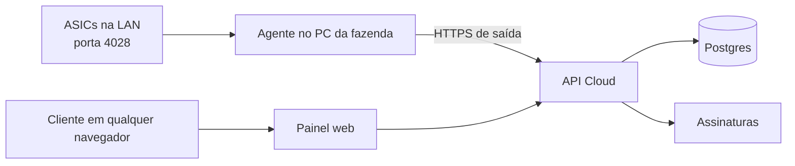

# Arquitetura inicial

## Agente local, não navegador

Um navegador não pode varrer IPs da rede local nem abrir sockets TCP para a porta
4028 das ASICs. Por isso o produto terá um executável Windows sem interface,
instalado como serviço no PC principal da fazenda. Ele inicia com o Windows,
faz as leituras locais e envia somente os resultados para a API em nuvem.

## Infraestrutura proposta

| Necessidade | Serviço inicial |
| --- | --- |
| Painel e API | Next.js em Vercel |
| Banco de dados | Postgres gerenciado |
| Autenticação | Organizações e permissões por usuário |
| Assinaturas | Faturas em USDT na rede Solana e monitoramento on-chain |
| Agente | Python empacotado como serviço Windows sem interface |

## Entidades

- **User**: pessoa que faz login.
- **Organization**: conta comercial do cliente.
- **Farm**: fazenda dentro de uma organização.
- **Agent**: instalação autorizada no PC da fazenda.
- **Miner**: ASIC cadastrada manualmente.
- **Metric**: leitura enviada pelo agente.
- **Subscription**: licença e estado da assinatura.

## Painel administrativo

O SaaS terá uma área exclusiva para operadores, em `/admin`, acessível somente
por usuários com papel `platform_admin`. Essa área não usa o escopo de uma
organização de cliente e permite controlar a operação inteira.

### Funções

- Listar, criar, bloquear e reativar clientes.
- Consultar organizações, fazendas, usuários, agentes e ASICs de cada cliente.
- Ver número de máquinas ativas, máquinas licenciadas e excedentes por conta.
- Criar licenças de demonstração, aplicar descontos e definir a data de término.
- Consultar assinatura, faturas, pagamentos recusados e período de tolerância.
- Suspender coleta e acesso ao painel de uma organização sem apagar histórico.
- Gerar código de ativação para um novo coletor e revogar agentes comprometidos.
- Acessar indicadores da plataforma: agentes online, ASICs monitoradas, receita
  recorrente, inadimplência e erros de coleta.

### Papéis

| Papel | Permissão |
| --- | --- |
| `platform_admin` | Administração global do SaaS e suporte a clientes |
| `org_owner` | Assinatura, usuários, fazendas e máquinas da própria organização |
| `org_operator` | Visualização e operação das fazendas autorizadas |
| `org_viewer` | Somente leitura do painel |

## Licença e cobrança

Máquinas cadastradas e ativas contam para a cobrança. A plataforma compara o total ativo com a quantidade licenciada. A tabela de faixas fica no banco: preço-base de US$ 3,00 e descontos progressivos configuráveis a partir de 15 máquinas.

## Pagamentos em USDT

O SaaS não dependerá de uma exchange para receber pagamentos. Em vez disso, terá
uma carteira de recebimento própria e monitorará os pagamentos diretamente na
blockchain. A rede aceita será **Solana**, e a página de fatura deixará essa rede
explícita para impedir depósitos por uma rede incorreta.

1. No início de cada ciclo, a API cria uma fatura com o número de máquinas
   licenciadas, desconto aplicado, total em USDT e data de vencimento.
2. O painel mostra endereço, QR Code, valor exato, rede TRC-20 e status pendente.
3. O monitor on-chain consulta os eventos de transferência USDT da carteira de
   recebimento na Solana e exige confirmações mínimas antes de marcar uma fatura como paga.
4. A confirmação ativa ou renova a licença automaticamente.
5. O pagamento atrasado aplica período de tolerância e, depois, suspende coleta
   e acesso até a regularização, sem apagar os dados do cliente.

Cada fatura terá um identificador de pagamento exclusivo. A versão inicial pode
usar um endereço exclusivo por fatura; depois, quando o volume crescer, um
serviço de carteira derivada gera endereços por organização sem expor a chave
privada ao painel nem à API de uso diário.

## Fases

1. Contas, organizações, fazendas, serviço coletor e ingestão de métricas.
2. Painel multiempresa e cadastro manual de ASICs.
3. Stripe, licença por máquina e bloqueio por assinatura.
4. Instalador Windows, atualização automática e alertas.
